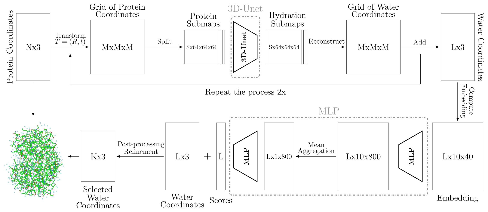

# HydraProt

HydraProt: A New Deep Learning Tool for Fast and Accurate Prediction of Explicit Water Positions for Protein Structures.



Figure: Schematic representation of the deep Hydration of Protein (HydraProt) pipeline. The process starts by transforming the protein's coordinates into a 3D grid array, which is then divided into submaps. These submaps are processed by a 3D U-net for water molecule sampling. The resulting hydration submaps are reconstructed into a full grid and converted back to 3D coordinates. This procedure is reiterated twice, each time adding the newly produced 3D coordinates to the previous set. The candidate water molecule points are subsequently embedded and evaluated via a Multilayer Perceptron (MLP). The final refinement step prunes and improves the placement of predicted water molecules.

<!--- Figure: Comparison of water predictions (cyan dots) generated by HydraProt with the ground truth (red dots) from PDB structure 4XED, recall is almost 66% for a distance from ground truth at 1.0 Å. -->

## Table of Contents

- [Description](#description)
- [Features](#features)
- [Installation (Linux)](#Installation-(Linux))
- [Usage](#usage)
- [License](#license)
- [Contributing](#contributing)
- [Contact](#contact)
- [Citing this work](#citing-this-work)

<a id="description"></a>
## Description

HydraProt is a deep learning methodology for predicting explicit water positions in protein structures. It combines a 3D U-net and a Multi-Layer Perceptron (MLP) to accurately sample and evaluate water coordinates. The methodology has been validated using a high-resolution dataset and offers valuable insights for protein structure studies and drug discovery.

<a id="features"></a>
## Features

 - Utilizes a 3D U-net architecture for accurate sampling of water coordinates in protein structures.
 - Incorporates a Multi-Layer Perceptron (MLP) to evaluate water positions in relation to protein atoms.
 - Rapid inference runtimes for fast predictions of explicit water positions.
 - Supports PDB and CIF file formats.

<a id="Installation-(Linux)"></a>
## Installation (Linux)

1\. Open the env_hydraprot.yml file and modify the last line to specify the desired installation location. For example, change prefix: /home/********/miniconda3/envs/hydraprot to prefix: /home/myplace/miniconda3/envs/hydraprot.

2\. Create the HydraProt environment by running the following command in your terminal:
```bash
conda env create -f ./env_hydraprot.yml
```
3\. Whenever you want to work on the project, activate the HydraProt environment by executing the following command in the terminal:

```bash
conda activate hydraprot
```

4\. Download from zenodo [https://doi.org/10.5281/zenodo.8386934](https://doi.org/10.5281/zenodo.8386934 ""), checkpoints of the models, the datasets used in this work, and the pdb of the presented results. Extract the files in the main directory of the project.

<a id="usage"></a>
## Usage

### Inference

#### To perform inference using HydraProt, follow these steps:


1. Open the params/prediction_params.py file.

2. Add your path to the directory with the PDB files you want to hydrate, line 9 config.pdb_path.

3. If you want to hydrate a subset of the PDBs within this directory, give the list of these files to config.pdb_list_path in line 11.

4. Select the cap for your prediction based on your preference, default is at 0.05 for high recall predictions, line 42 config.final_cap.

5. Finally, define the directory you want to save the results, line 48 config.results_dir.

6. Optional, if it is needed based on your machine specification you will need to adjust line 24 config.device, line 25 config.unet_batch_size, and line 40 config.mlp_batch_size. These parameters have been adjusted for a CUDA device with 4GB of RAM.

```bash
# Then execute
python predict.py
```

### Create Dataset for the 3D-Unet

1. Open with Jupyter Lab the Jupyter Notebook `datasets/create_datasets/create_unet_dataset.ipynb`.

2. Change the variables `h5_dir`, `training_list`, `pdb_path`, and `validation_list` to your parameters.

3. Run all cells and then update the paths to datasets at `params/unet_params.py`.


### Training and Evaluation of 3D U-net

Check and change the parameters in `params/unet_params.py`.

```bash
# Then execute
python train_unet.py
```
For the evaluation of checkpoints check and modify the parameters in `params/unet_params.py` and `evaluate_unet.py`, then:

```bash
# Execute the following command
python evaluate_unet.py
```

### Create Dataset for the MLP

1. Open the Jupyter Notebook 'datasets/create_datasets/unet_prediction.ipynb' using Jupyter Lab.

2. Modify the variables `train_list`, `validation_list`, `pdb_path`, `config`, checkpoint of 3D-Unet, and `pdb_dir` based on your parameters.

3. Run all cells.

4. Next, open the Jupyter Notebook 'datasets/create_datasets/create_mlp_dataset.ipynb'.

5. Modify the variables `train_list`, `validation_list`, `pdb_path`, and `prediction_dir` according to your parameters.

6. Run all cells and update the dataset paths in `params/mlp_params.py`.

### Training and Evaluation of MLP

Check and modify the parameters in `params/mlp_params.py`.

```bash
# Execute the following command
python train_mlp.py
```
For the evaluation of checkpoints check and modify the parameters in `params/mlp_params.py` and `evaluate_mlp.py`, then:

```bash
# Execute the following command
python evaluate_mlp.py
```
<a id="license"></a>
## License

This project is licensed under the MIT License - see the LICENSE file for details.

<a id="contributing"></a>
## Contributing

If you encounter any issues or have suggestions for improvement, please create an issue on GitHub. We appreciate your contribution!

<a id="contact"></a>
## Contact

For queries and suggestions, please contact: andreas.zamanos@athenarc.gr

<a id="citing-this-work"></a>
## Citing this work

LINK TO PAPER PUBLICATION
